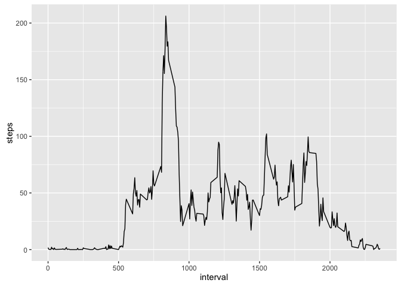

# Reproducible Research: Peer Assessment 1
Billy Jackson  
### Introduction
This report will analyze data from a personal activity monitoring device.  The devide collects data at 5 minute intervals throughout the day.  The data consists of two months of data from an anonymous individual during the months of October and November, 2012.

### Loading and preprocessing the data
I'll be using the `ggplot2` library for some graphs in this report.

First thing is to load `ggplot2` and to read in the raw data by the `read.csv` function

```r
#Load necessary libraries
library(ggplot2)

#Read in data
df <- read.csv("activity.csv")
df$date <- as.Date(df$date)
```
The dates turned out to be read in as characters, so you can see 
I coerced them into the `date` class.


### What is mean total number of steps taken per day?
Let's take a look at the histogram of the number of steps taken each day

```r
dailytotals <- aggregate(steps ~ date, data = df, FUN = sum, na.rm = TRUE)
hist(dailytotals$steps, xlab = "Steps", main = "Histogram of Total Steps each day")
```

\
You can see that the "average" number of steps taken is around 10,000-15,000 per day.

We can confirm that by looking at the exact mean and median steps taken each day:

```r
mean(dailytotals$steps)
```

```
## [1] 10766.19
```

```r
median(dailytotals$steps)
```

```
## [1] 10765
```
So the "average" number of steps taken appears to be around 10,000-11,000, which
agrees with our histogram.


### What is the average daily activity pattern?
To see what the average daily activity pattern looks like, a time-series plot
could be helpful.

```r
intervalmeans <- aggregate(steps ~ interval, data = df, FUN = mean, na.rm = TRUE)
ggplot(intervalmeans, aes(interval, steps)) + geom_line()
```

\

This gives us a nice general picture.  Now lets look at which exact 
5 minute time interval has the most step activity

```r
intervalmeans[which(intervalmeans$steps == max(intervalmeans$steps)),]
```

```
##     interval    steps
## 104      835 206.1698
```
So, the 104th interval, which is minutes 835-840 of the day, has the most average steps
at about 206 steps taken in those 5 minutes.


### Imputing missing values
There are a number of days/intervals where there are missing values coded as `NA`,
including some of our first observations which we can see in `head(df)`:

```
##   steps       date interval
## 1    NA 2012-10-01        0
## 2    NA 2012-10-01        5
## 3    NA 2012-10-01       10
## 4    NA 2012-10-01       15
## 5    NA 2012-10-01       20
## 6    NA 2012-10-01       25
```

To see how many total missing values there are, we can look at:

```r
sum(is.na(df$steps)) 
```

```
## [1] 2304
```
These 2,304 missing values may introduce bias into our calculations, so let's fill in
the missing data values.  In this report, we will fill them in with the mean
steps for that time interval and assign it to a new dataframe called `nacomplete`.

```r
nalocations <- which(is.na(df$steps)) #get the row #s for all NAs
nacomplete <- df
for(i in nalocations){
        intervalnumber <- nacomplete[i,3]
        nacomplete[i,1] <- intervalmeans[intervalmeans$interval == intervalnumber, ]$steps
}
head(nacomplete)
```

```
##       steps       date interval
## 1 1.7169811 2012-10-01        0
## 2 0.3396226 2012-10-01        5
## 3 0.1320755 2012-10-01       10
## 4 0.1509434 2012-10-01       15
## 5 0.0754717 2012-10-01       20
## 6 2.0943396 2012-10-01       25
```
You can see that those NAs in `df` have now been filled in `nacomplete`

Let's take a look at our `nacomplete` data.  First, it's histogram:

```r
dailytotals2 <- aggregate(steps ~ date, data = nacomplete, FUN = sum, na.rm = TRUE)
hist(dailytotals2$steps, xlab = "Steps", main = "Histogram of Total Steps w/ NA's complete")
```

\

Not much different here.  Now, let's look at the mean and median of the `nacomplete` data:

```r
mean(dailytotals2$steps)
```

```
## [1] 10766.19
```

```r
median(dailytotals2$steps)
```

```
## [1] 10766.19
```
We can see that the mean was unchanged.  This is expected since the NA values 
originally unaccounted for were replaced by interval means.  
The median increased slightly.  This slight change has to do with the location of where the NAs
are relative to the median.  The slight change of 1 step is negligent relative to the size of the median.

So overall, the impact of imputing missing data has little discernible impact
on the estimates on the estimates of the total daily number of steps.


### Are there differences in activity patterns between weekdays and weekends?
Let's see if this individual had any difference in activity on weekdays 
compared to weekends.  
The following code will classify each day as a weekday or weekend 
and create a time series plot of the average number of steps taken
for each type of day.

```r
wdays <- c("Monday", "Tuesday", "Wednesday", "Thursday", "Friday")
nacomplete$typeofday <- factor(weekdays(nacomplete$date) %in% wdays, 
                        levels=c(TRUE, FALSE), labels=c('weekday', 'weekend'))
intervalmeans2 <- aggregate(steps ~ interval + typeofday, data = nacomplete, FUN = mean)
qplot(interval, steps, data = intervalmeans2, facets = .~typeofday, geom = "path")
```

\

You can see that the individual has a noticeable peak around 8:00-9:00am on weekdays,
while the step count is more consistent throughout the day on weekends.
